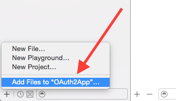
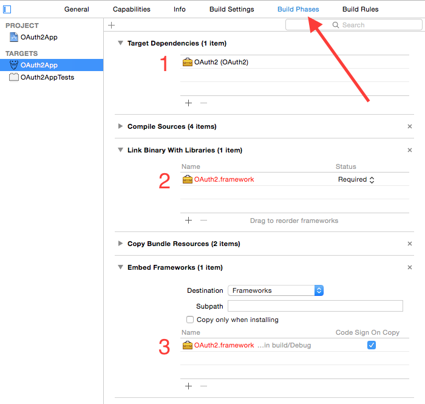

OAuth2
======

OAuth2 frameworks for **OS X** and **iOS** written in Swift.

The code in this repo requires Xcode 6, the built framework can be used on **OS X 10.9** or **iOS 8** and later.
To use on **iOS 7** you'll have to include the source files in your main project.
_Note_ that it's possible to run embedded frameworks in iOS 7 with some tricks, however you will not be able to submit such an App to the App Store.
Supported OAuth2 [flows](#flows) are the _code grant_ (`response_type=code`) and the _implicit grant_ (`response_type=token`).

Since the Swift language is constantly evolving I am [adding tags](https://github.com/p2/OAuth2/releases) to mark which revision should work with which Swift version.


Installation
------------

Currently the best way to obtain the framework is via git.

#### git

Using Terminal.app, clone the OAuth2 repository, best into a subdirectory of your app project:  

    $ cd path/to/your/app
    $ git clone https://github.com/p2/OAuth2.git

If you're using git you'll want to add it as a submodule.
Once cloning completes, open your app project in Xcode and add `OAuth2.xcodeproj` to your app:



Now link the framework to your app:



These three steps are needed to:

1. Make your App also build the framework
2. Link the framework into your app
3. Embed the framework in your app when distributing

> NOTE that as of Xcode 6.2, the "embed" step happens in the "General" tab.
> You may want to perform step 2 and 3 from the "General" tab.
> Also make sure you select the framework for the platform (OS X vs. iOS).
> This is currently a bit tricky since Xcode shows both as _OAuth2.framework_; I've filed a bug report with Apple so that it also shows the target name, fingers crossed.

Usage
-----

For a typical code grant flow you want to perform the following steps.
The steps for other flows are mostly the same short of instantiating a different subclass and using different client settings.
If you need to provide additional parameters to the authorize URL take a look at `authorizeURLWithRedirect(redirect:scope:params:)`.

1. Create a settings dictionary.
    
    ```swift
    let settings = [
        "client_id": "my_swift_app",
        "client_secret": "C7447242-A0CF-47C5-BAC7-B38BA91970A9",
        "authorize_uri": "https://authorize.smartplatforms.org/authorize",
        "token_uri": "https://authorize.smartplatforms.org/token",
        "scope": "profile email",
        "redirect_uris": ["myapp://oauth/callback"],   // don't forget to register this scheme
    ]
    ```

2. Create an `OAuth2CodeGrant` instance, optionally setting the `onAuthorize` and `onFailure` closures to keep informed about the status.
    
    ```swift
    let oauth = OAuth2CodeGrant(settings: settings)
    oauth.viewTitle = "My Service"      // optional
    oauth.onAuthorize = { parameters in
        println("Did authorize with parameters: \(parameters)")
    }
    oauth.onFailure = { error in        // `error` is nil on cancel
        if nil != error {
            println("Authorization went wrong: \(error!.localizedDescription)")
        }
    }
    ```

3. Now either use the built-in web view controller or manually open the _authorize URL_ in the browser:
    
    **Embedded (iOS)**:
    
    ```swift
    let vc = <# presenting view controller #>
    let web = oauth.authorizeEmbeddedFrom(vc, params: nil)
    oauth.afterAuthorizeOrFailure = { wasFailure, error in
        web.dismissViewControllerAnimated(true, completion: nil)
    }
    ```
    
    **iOS browser**:
    
    ```swift
    let url = oauth.authorizeURL()
    UIApplication.sharedApplication().openURL(url)
    ```
    
    Since you opened the authorize URL in the browser you will need to intercept the callback in your app delegate.
    Let the OAuth2 instance handle the full URL:
    
    ```swift
    func application(application: UIApplication!,
                     openURL url: NSURL!,
               sourceApplication: String!,
                      annotation: AnyObject!) -> Bool {
        // you should probably first check if this is your URL being opened
        if <# check #> { 
            oauth.handleRedirectURL(url)
        }
    }
    ```

4. After everything completes either the `onAuthorize` or the `onFailure` closure will be called, and after that the `afterAuthorizeOrFailure` closure if it has been set.

5. You can now obtain an `OAuth2Request`, which is an already signed `NSMutableURLRequest`, to retrieve data from your server.
    
    ```swift
    let req = oauth.request(forURL: <# resource URL #>)
    let session = NSURLSession.sharedSession()
    let task = session.dataTaskWithRequest(req) { data, response, error in
        if nil != error {
            // something went wrong
        }
        else {
            // check the response and the data
            // you have just received data with an OAuth2-signed request!
        }
    }
    task.resume()
    ``` 


Flows
-----

Based on which OAuth2 flow that you need to use you will want to use the correct subclass.
For a very nice explanation of OAuth's basics: [The OAuth Bible](http://oauthbible.com/#oauth-2-three-legged).

#### Code Grant

For a full OAuth 2 code grant flow you want to use the `OAuth2CodeGrant` class.
This flow is typically used by applications that can guard their secrets, like server-side apps, and not in distributed binaries.
In case an application cannot guard its secret, such as a distributed iOS app, you would use the _implicit grant_ or, in some cases, still a _code grant_ but omitting the client secret.

#### Implicit Grant

An implicit grant is suitable for apps that are not capable of guarding their secret, such as distributed binaries or client-side web apps.
Use the `OAuth2ImplicitGrant` class to receive a token and perform requests.

Would be nice to add another code example here, but it's pretty much the same as for the _code grant_.


### Site-Specific Peculiarities

Some sites might not strictly adhere to the OAuth2 flow.
The framework deals with those deviations by creating site-specific subclasses.

- Facebook: `OAuth2CodeGrantFacebook` to deal with the [URL-query-style response](https://developers.facebook.com/docs/facebook-login/manually-build-a-login-flow/v2.2) instead of the expected JSON dictionary.


Playground
----------

The idea is to add a Playground to see OAuth2 in use.
However, it's not currently possible to interact view WebViews inside a playground, which would be needed to login to a demo server.
Hence I made a [sample OS X App](https://github.com/p2/OAuth2App) that uses the GitHub API do demonstrate how you could use this framework.

There is some stub code in `OSX.playground` if you'd like to tinker.
It's not working as one needs to open the authorize URL in a browser, then copy-paste the redirect URL from OS X's warning window into the Playground – which makes OAuth2 regenerate its state, making your redirect URL invalid.
Fun times.


License
-------

This code is released under the _Apache 2.0 license_, which means that you can use it in open as well as closed source projects.
Since there is no `NOTICE` file there is nothing that you have to include in your product.

> Copyright 2015 Pascal Pfiffner
> 
> Licensed under the Apache License, Version 2.0 (the "License");
> you may not use this file except in compliance with the License.
> You may obtain a copy of the License at
> 
>   [http://www.apache.org/licenses/LICENSE-2.0]()
> 
> Unless required by applicable law or agreed to in writing, software
> distributed under the License is distributed on an "AS IS" BASIS,
> WITHOUT WARRANTIES OR CONDITIONS OF ANY KIND, either express or implied.
> See the License for the specific language governing permissions and
> limitations under the License.
